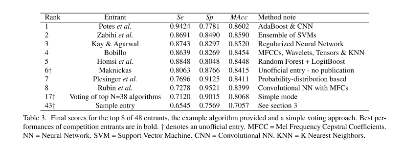

# Project: Automatic Heart Sound Classification

This repository contains implementations of different deep learning networks which can efficiently classify normal/abnormal heartsound with only PCG (Phonocardiography) input. The framework is based on [pytorch-template](https://github.com/victoresque/pytorch-template).

## Dataset

We use the heart sound signals from the [PhysioNet/CinC challenge 2016](https://physionet.org/content/challenge-2016/1.0.0/), which contains in total of 3,240 heart sound recordings, lasting from 5 seconds to around 120 seconds. 

Below is the scores of the challenge[^1]

[^1]: G. D. Clifford et al., "Classification of normal/abnormal heart sound recordings: The PhysioNet/Computing in Cardiology Challenge 2016," 2016 Computing in Cardiology Conference (CinC), 2016, pp. 609-612.]



As no official data splits were provided, we use train_test_split from sklearn.model_selection to split the data into train(80%), val(10%) and test(10%). By following command, you can train a single fold model, and a `train.csv` and `test.csv` will be automatically generated under `data/`. 

```bash
python train.py -c config/config_crnn.json.json
```

A k-fold validation framework is also implemented.

```bash
python train_fold_validation.py -c config/config_crnn.json
```

## Audio Preprocess & Feature Extraction
- The fifth order Butterworth band-pass filter was applied to remove low-frequency artifacts, baseline wandering as well as high-frequency inference.
Log-Mel Spectrogram with 128 Mel-bins were selected in the experiment. 
- No extra segmentation was applied in this work.
- Log-Mel Spectrogram with 128 Mel-bins are selected as the input features. File to extract features can be find in `utils/audio_feature_extractor.py`.

## Models
Four different types of neural networks were adopted in the project. The structures of each type are illustrated below:

### simple_cnn


### VGG_like CNN


### BiLSTM


### CRNN


## Validation metrics


- $$Accuracy = (TP + TN) \ (TP + FN + FP + TN)$$
- $$Sensitivity = TP \ (TP + FN) $$
- $$Sensitivity = TN \ (FP + TN) $$
- $$MAcc = (Sensitivity + Specificity) \ 2 $$
- $$F1 Score = 2 * TP \ (2 * TP + FP + FN)$$

## Results

| Model     |Model size|Accuracy|Sensitivity|Specificity|MAcc   | F1 Score  |
| ----------|----------|--------|---------- | ----------|-------| ----------|
| simple_cnn|428.5MB   |85.2    |83.6       |91.9       |87.8   |90.1       |
| VGG11     |72MB      |92.3    |95.4       |79.0       |87.2   |95.2       | 
| BiLSTM    |37MB      |83.0    |82.1       |87.1       |84.6   |88.7       | 
| CRNN      |59MB      |88.0    |86.6       |93.5       |90.1   |92.1       |

10 fold validation with model CRNN

|Fold      |Accuracy|Sensitivity|Specificity|MAcc   | F1 Score  |
| ----------|--------|---------- | ----------|-------| ----------|
|1          |0.898   |0.891      |0.925      |0.908  |0.933      |
|2          |0.941   |0.961      |0.866      |0.913  |0.963      |
|3          |0.917   |0.926      |0.881      |0.903  |0.946      |
|4          |0.929   |0.914      |0.985      |0.950  |0.953      |
|5          |0.935   |0.946      |0.896      |0.921  |0.959      |
|6          |0.809   |0.775      |0.940      |0.857  |0.866      |
|7          |0.886   |0.876      |0.924      |0.900  |0.924      |
|8          |0.898   |0.888      |0.940      |0.913  |0.933      |
|9          |0.898   |0.899      |0.894      |0.897  |0.934      |
|10         |0.880   |0.888      |0.848      |0.868  |0.922      |
|Average    |0.899   |0.896      |0.910      |0.903  |0.933      |  

requirements

```bash
gensim==4.1.2
h5py==2.10.0
librosa==0.8.1
numba==0.54.0
numpy==1.20.3
opencv-python==4.5.5.62
pandas==1.3.3
pylint==2.11.1
pyparsing==2.4.7
scikit-learn==0.24.2
scipy==1.7.1
six==1.16.0
SoundFile==0.10.3.post1
spacy==3.2.1
spacy-legacy==3.0.8
spacy-loggers==1.0.1
tensorboard==2.7.0
tensorboard-data-server==0.6.1
tensorboard-plugin-wit==1.8.0
tokenizers==0.11.4
torch==1.10.0
tqdm==4.62.2
urllib3==1.26.6
zsvision==0.7.12
```
